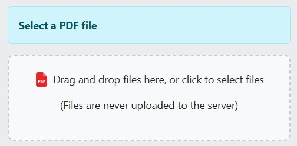
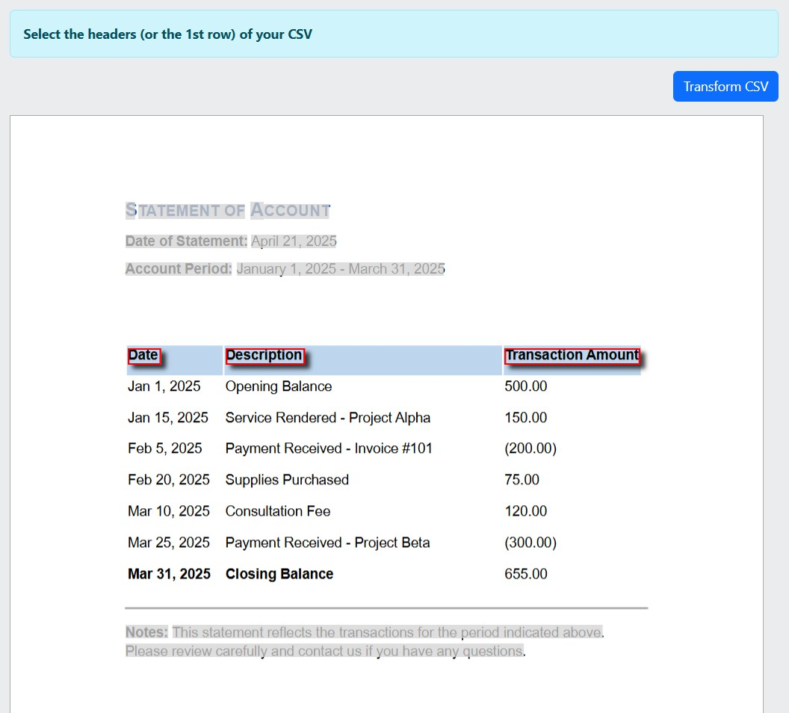
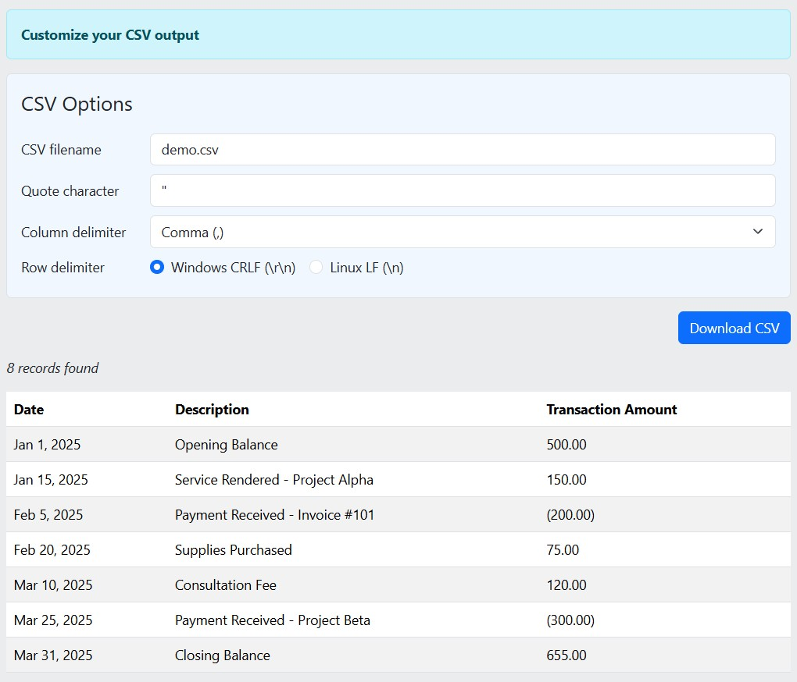

#  PDF DataTable

PDF DataTable is a free tool for exporting PDFs to CSV.  
**[Get Started](https://pdf-datatable.hanwg.top/)**

[What's new?](https://pdf-datatable.hanwg.top/whats-new)

# Features & Screenshots

**Privacy and security**

Keep your data private and secure.
We never upload or store your files, and your passwords stay on your device.
Get started worry-free.

**Easily select PDF files with Drag 'n Drop**

**Works with password-protected PDFs**

Don't let locked PDFs stop you. PDF DataTable has built-in support for password-protected PDFs.
Coming soon

**PDF preview**

PDF DataTable allows you to select where your data starts on your PDF.
Watch real-time previews of your CSV records as you navigate through elements in your PDF.  
(Elements excluded from the CSV are greyed-out)

**CSV options**

With customizable CSV options, you have the flexibility to choose delimiters and quote characters.

# Documentation

Please refer to the **[Wiki](https://github.com/hanwg/pdf-datatable/wiki)**.

# FAQ

Please refer to the **[FAQ](https://pdf-datatable.hanwg.top/faq)** on the website.